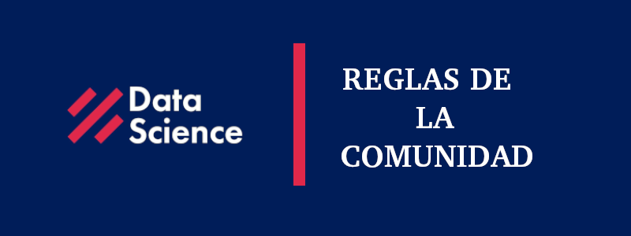

# Reglas _2021-01-04_

Reglas para la comunidad y subcomunidades de Data Science Research Perú (FB,WZ,TG,IG,SL)

## :octocat: Reglas generales :octocat:

- ⚠️Razones de Ban⚠️ 
  - Spamm: mensajes reenviados, cadenas de texto, stickers seguidos.
  - Venta y compra de divisas y criptomonedas.
  - Respeto: insultos, xenofobia, incitación al odio o discriminación.
  - Temas prohibidos: farándula.
  - Publicidad de marcas, empresas, servicios con fines de lucro o similares.
  - Proselitismo político.
  - Contenido pornográfico o enlaces a sitios de este tipo.
  
- No compartir ofertas laborales*

>*Ver último inciso.

>**Los administrador de cada grupo toman la decisión de separar o no miembros de los grupos en base a estas reglas.

## 👩‍💻 Temas permitidos en los grupos moderados por DSRP 👩‍💻

1. Ciencia de datos
2. Inteligencia Artificial
3. Tecnologías 4.0
4. Realidad Nacional
5. Proyectos sociales

## Código de conducta

Acorde a Contributor Covenant. Ver en [español](CC_es.md) o [inglés](CC_us.md)

## ⚠ En caso de Ofertas laborales ⚠

Enviar un correo a informes@datascience(.)pe. Se publicará en www.datascience.pe .
